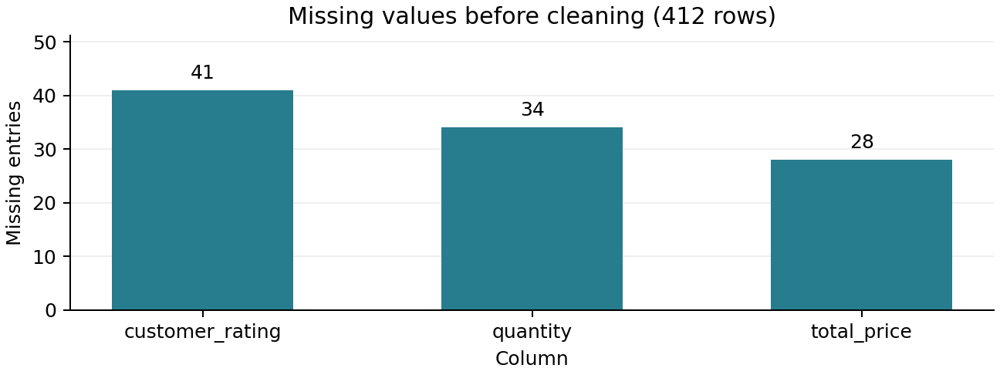
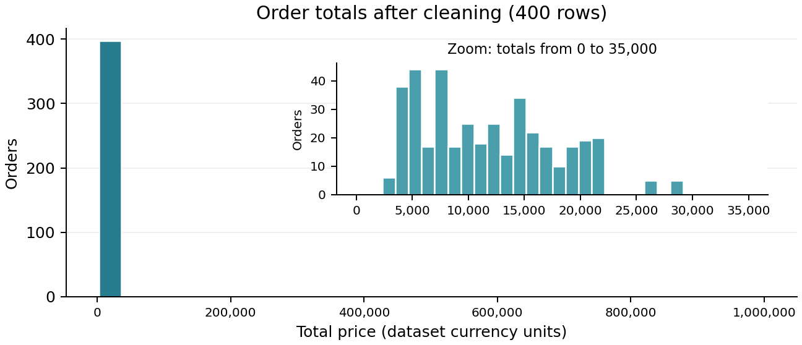
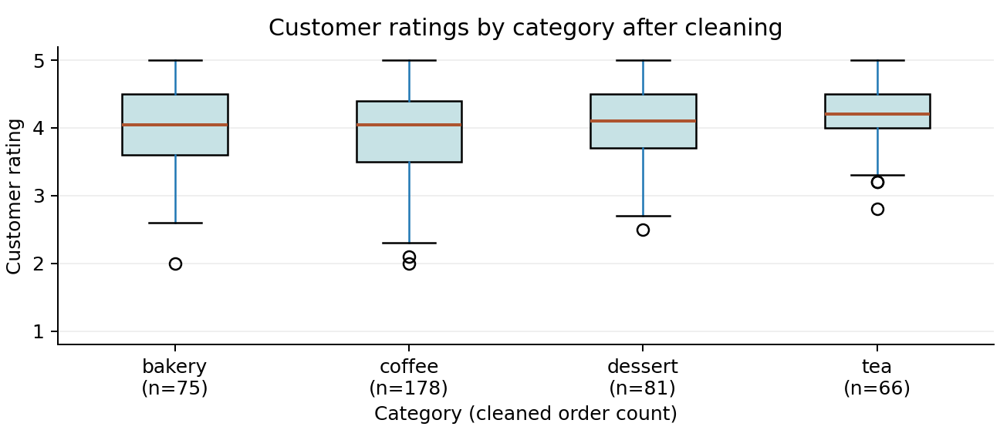

# Lab 1 Report - {student_id} {name}

## 1. What I did

The cleaning sequence was kept unchanged; tied missing counts use stable sorting. Flagged bulk orders were retained, and Figure 2 adds a zoomed inset to show ordinary orders without hiding the full range.

## 2. Results

**Table 1. Key numbers from results.json.** The revenue leader is interpreted alongside group counts and bulk orders, rather than as a typical-order ranking.

| Metric | Value |
|--------|-------|
| Rows raw / clean | {n_rows_raw} / {n_rows_clean} |
| Duplicates removed | {n_duplicates_removed} |
| Missing values (raw to clean) | {missing_total_raw} to {missing_total_clean} |
| Quantity outliers (IQR, k = 1.5) | {n_outliers_quantity} |
| Top category by revenue | {top_category_by_revenue} |
| Mean rating (clean) | {mean_rating_clean} |

## 3. Figures

Figures 1-3 show where data are missing, how order totals are distributed, and how ratings vary across categories.

**Figure 1. Missing entries by column in the raw data.** Ratings have 41 missing entries, quantities 34, and totals 28; the other six columns have none. Optional feedback or incomplete transaction capture could explain this pattern, but missing counts alone cannot establish the cause.

<!-- pagebreak -->

## 3. Figures (continued)

**Figure 2. Cleaned order totals, full range and zoom.** The main histogram includes every order in 30 bins; the inset shows totals from 0 to 35,000. The long right tail raises the mean to 17,405 above the median of 11,000, making the median more representative of an ordinary order.

**Figure 3. Cleaned ratings by category.** Tea has the highest median (4.20), but its 66 orders form the smallest group and the distributions overlap. Counts include imputed ratings; the observed-rating counts are discussed below.

<!-- pagebreak -->

## 4. Interpretation

Figure 1 counts missing cells, not distinct orders. After removing 12 duplicates, 32 quantities, 27 totals, and 40 ratings require filling. The deduplicated quantity median is 2; the rating fill value is 4.04. Filling ratings with a single global mean pulls group averages toward that value and reduces variation: tea's mean changes from 4.225 (59 observed ratings) to 4.206 (66 cleaned orders). Figure 3 therefore supports a descriptive comparison, not a claim of statistically established superiority.

For quantity, Q1 = 2 and Q3 = 4 give fences of -1 and 7. The three flags are orders of 120, 150, and 200 units. They are plausible bulk purchases, not established errors, so they remain in Table 1 and Figure 2. Their combined revenue is 2,335,000, or 33.5% of the total 6,962,000. Excluding them as a sensitivity check still leaves coffee first: 2,114,500 versus dessert's 1,028,000.

Coffee leads Table 1 with revenue 3,114,500 across 178 orders, while dessert has 2,363,000 across 81. Dessert's larger mean order total (29,172.84 versus 17,497.19) shows that revenue rank partly reflects order count and extreme orders, not simply larger typical purchases.

Median quantity imputation can concentrate reconstructed totals around twice the unit price. Figure 2 alone cannot separate that effect from genuine small orders. Existing totals were preserved as required: 19 rows no longer equal unit price times filled quantity. Their original quantities were missing; there were no such mismatches among rows with both values observed. These differences are a consequence of the prescribed repair, not evidence that the stored receipts were wrong.

## 5. Limitations

If dissatisfied customers disproportionately omit ratings, mean imputation could overstate satisfaction and change the category comparison. Recovering those ratings or learning the missingness mechanism could reverse the apparent tea advantage; the synthetic sample does not establish a real cafe's customer preferences.

## 6. AI & external-code usage

**Table 2. Assistance and source disclosure.** ChatGPT was used for consultation on the assignment requirements and implementation approach, report design, and refactoring. I completed the remaining work myself, as detailed below.

| Tool / Source | Part used for | What I modified & verified myself |
|---------------|---------------|-----------------------------------|
| OpenAI ChatGPT | Consultation on assignment requirements and implementation approach; assistance with report design and refactoring. | I wrote the initial implementation, created the plots, performed the analysis, wrote the report text, and carried out testing and submission preparation. |
| Course-provided lab01_concepts.pdf, README, docstrings, and report template | Cleaning order, imputation assumptions, IQR interpretation, report layout, and submission rules. | I checked the implementation and report against these supplied materials. |
| External code | Standard library and installed packages only; no third-party solution snippets were copied. | I ran the code and checked its outputs and test results. |
