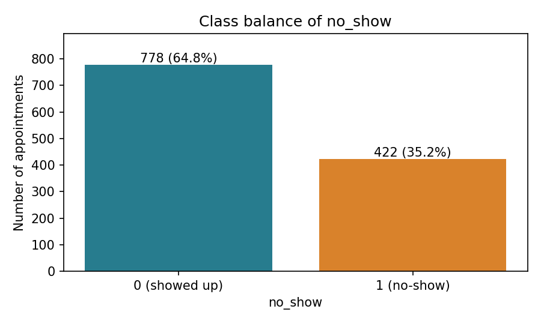
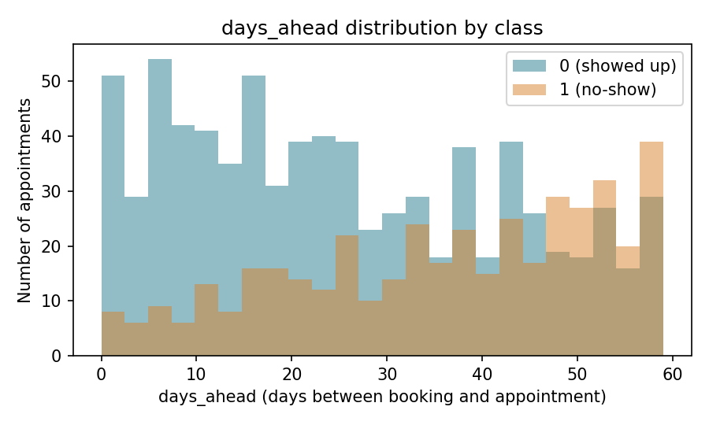
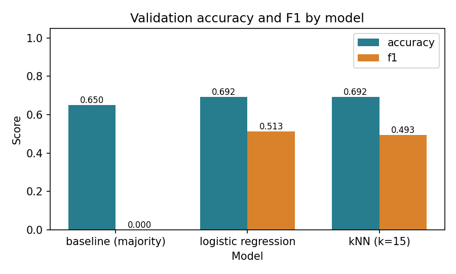

# Lab 2 Report - {student_id} {name}

## 1. What I did

The six TODO blocks follow the skeleton specification; nothing is fitted before the split, and every scaler lives inside a Pipeline. Both metric functions convert inputs with np.asarray and count the confusion-matrix cells (or residuals) directly, applying the 0.0 convention for every zero denominator. Beyond the public tests, I checked the metrics against sklearn on 400 random cases, confirmed that the fitted scaler mean equals the training-split mean, and confirmed that a different seed gives a different split.

## 2. Results

**Table 1. All three models under one split, one seed, one metric definition.** The baseline predicts "showed up" for all 240 validation rows, so its accuracy equals the majority share and every positive-class metric is 0; the other rows must be read as gains over that.

| Model | Accuracy | Precision | Recall | F1 |
|-------|----------|-----------|--------|----|
| baseline (majority) | {baseline_accuracy} | {baseline_precision} | {baseline_recall} | {baseline_f1} |
| logistic regression | {logreg_accuracy} | {logreg_precision} | {logreg_recall} | {logreg_f1} |
| kNN (k=15) | {knn_accuracy} | {knn_precision} | {knn_recall} | {knn_f1} |

**Table 2. Regression on wait_minutes, same discipline.** The mean baseline's R² of {reg_baseline_r2} is the zero point of R²; linear regression cutting MAE from {reg_baseline_mae} to {reg_linreg_mae} minutes shows the features carry real signal about waiting time.

| Model | MAE | RMSE | R² |
|-------|-----|------|----|
| baseline (mean) | {reg_baseline_mae} | {reg_baseline_rmse} | {reg_baseline_r2} |
| linear regression | {reg_linreg_mae} | {reg_linreg_rmse} | {reg_linreg_r2} |
| kNN (k=15) | {reg_knn_mae} | {reg_knn_rmse} | {reg_knn_r2} |

## 3. Figures

**Figure 1. Class balance of no_show.** 778 of {n_samples} appointments (64.8%) were kept and 422 (35.2%) were no-shows, so a model that always predicts "kept" should already score about 0.65 accuracy before any training.

<!-- pagebreak -->

**Figure 2. days_ahead distribution by class.** No-shows shift toward longer lead times (mean 36.4 vs 25.5 days, median 39 vs 23), and from about 47 days on they outnumber kept appointments. The two histograms still overlap over the whole 0-59 range, so this feature alone cannot separate the classes.

**Figure 3. Accuracy and F1 by model.** The baseline's accuracy bar is nearly as tall as the trained models', but its F1 bar is zero. Accuracy mostly rewards the majority class; F1 only counts no-shows that were actually found.

<!-- pagebreak -->

## 4. Interpretation

The baseline accuracy of {baseline_accuracy} in Table 1 is simply the kept share visible in Figure 1: the stratified split keeps 156 of 240 validation rows at label 0. Because the baseline never predicts a no-show, TP + FP = 0 and TP = 0, so precision, recall and F1 all fall to 0 by the zero-division convention. The honest reading of the trained models is therefore about +4 points of accuracy and F1 rising from 0 to about 0.5, not "69% accuracy".

Logistic regression and kNN tie exactly on accuracy (166 of 240 correct each) but differ on errors: logistic regression finds 39 of 84 no-shows with 29 false alarms, kNN finds 36 with 26. Logistic regression therefore wins on recall and F1 ({logreg_f1} vs {knn_f1}), which matters because a missed no-show wastes a slot. Figure 2 is consistent with this: the no-show share rises steadily with days_ahead, a monotone trend that a linear decision boundary captures directly, and days_ahead and prior_noshows have the largest standardized coefficients. kNN instead averages 15 neighbours in a space where the weakly related features (age, distance) count as much as the informative ones.

The scaler must live inside the Pipeline because its mean and standard deviation are learned parameters. Fitting it before the split would let the validation rows shape the transform used to evaluate them; the Pipeline fits it on the training split only, and I verified that the fitted mean equals the training mean.

In Table 2 the baseline predicts the training mean everywhere, which is exactly the reference R² compares against, so its R² is 0 up to the difference between the training and validation means. Linear regression reaches R² = {reg_linreg_r2} and beats kNN on every metric, suggesting waiting time here is close to an additive linear function of the features (queue length dominates, at about +30 minutes per standard deviation). kNN can only average nearby training targets, which smooths the trend and biases predictions at the edges of the feature range.

## 5. Limitations

Every number comes from one 240-row validation split. The logistic regression vs kNN gap in F1 is only 3 no-shows, so a different seed or 5-fold cross-validation could reverse which classifier wins; the conclusion that both beat the baseline is much more robust than their ranking. The default 0.5 threshold is also unexamined: lowering it would trade precision for recall, which the clinic may prefer.

## 6. AI & external-code usage

**Table 3. Assistance and source disclosure.** Every AI tool and external source used for this lab.

| Tool / Source | Part used for | What I modified & verified myself |
|---------------|---------------|-----------------------------------|
| Anthropic Claude Code (Claude Opus 5.5) | Drafted the six TODO implementations in src/lab02.py, the three notebook plot cells, an extra edge-case test script, the report draft, and the PDF/zip packaging scripts. | Verified by running the public tests (9 passed) and the extra checks, and by matching every classification and regression number against the concept note's reference values. I reviewed the code and report text against results.json and the figures before submitting. |
| Course-provided lab02_concepts.pdf, README, docstrings, report template | Metric definitions, zero-division conventions, pipeline and split requirements, report structure. | Implementation and report were checked against these supplied materials. |
| External code | numpy, pandas, scikit-learn, matplotlib; ReportLab/pypdf/PyMuPDF only for building the PDF (not imported by src/lab02.py). | No third-party solution code was copied. |
